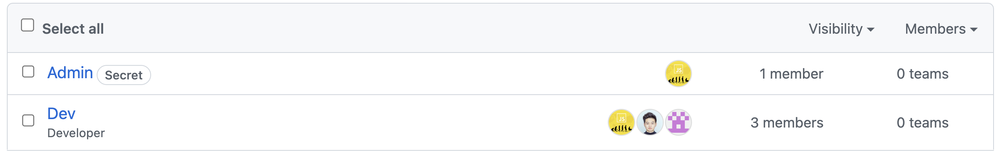
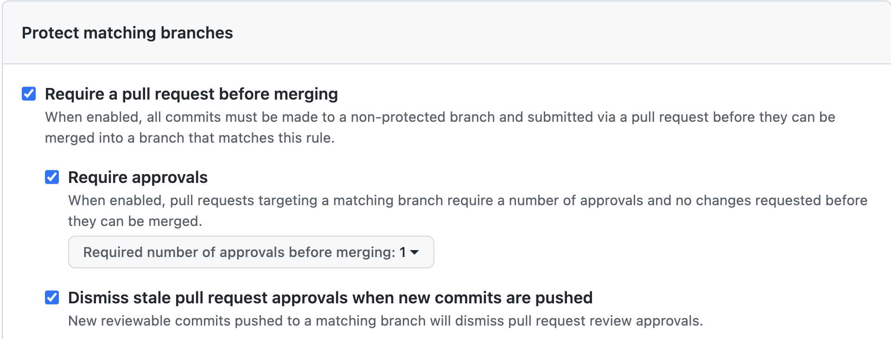
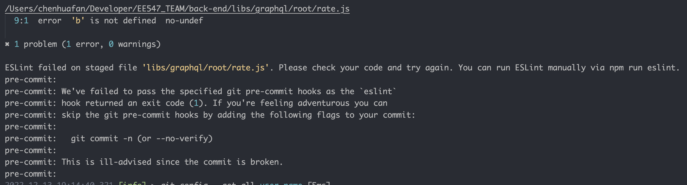
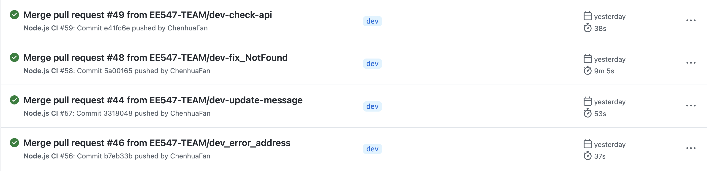

[Github Repo Link](https://github.com/orgs/EE547-TEAM/repositories)

## Getting Started

First, run the development server:

```bash
npm i 
npm run dev
```

# Guideline

`pages` main pages for NextJS

`graphql/*` all graphql definitions.

# Development

First, we use the Github organization to help us manage our project progress, front-end/back-end repos,  actions (CI/CD), team role and permission.

Before we start the project, we add strict git branch restrictions, and Airbnb coding style to guarantee the consistency of style and quality of codes. Meanwhile, by adding a reviewer to the pull request, we can prevent disruptive updates. When we are coding, the Eslint will check automatically if our code meets the rules. Also when we save the file, Eslint will change all coding that doesn't fit the rules.

### Team

* Admin Team: All permission
* Dev Team: modify only

  

### Git Branch Policy

`Dev` is the protected branch. Blow is the policies applied for this branch.



`Eslint` style check before commit (git precommit hook).

`.github/hooks/eslint.sh` is the eslint pre-commit scripts.



### Workflow

Our Action workflow is test, compile and development. After we commit our change, push commits to remote git repo and create a pull request on Github. The pull request will ask a reviewer to make sure if anything will affect the dev branch. Reviewer can reject the request or approve. After the reviewer approves the request then the authorized account (watcher) can merge the code into the development branch, which triggers an automatic deployment job.

`.github/workflows/backend_deployment.yml` is the auto deployment workflow script.


